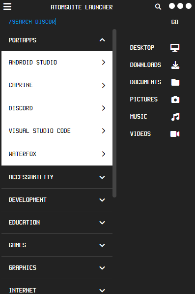
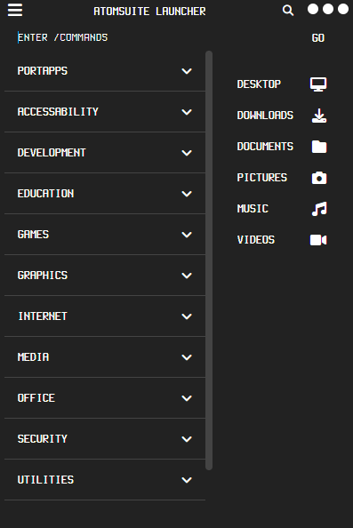

# ATOMSUITE BOILERPLATE

## OVERVIEW

ATOMSUITE BOILERPLATE IS A COMPREHENSIVE STARTER TEMPLATE FOR BUILDING CROSS-PLATFORM DESKTOP APPLICATIONS USING ELECTRON.JS, HTML5, CSS3, SASS, JAVASCRIPT, AND NODE.JS. THIS BOILERPLATE SERVES AS THE FOUNDATION FOR ALL ATOMSUITE PROJECTS, PROVIDING A CONSISTENT AND EFFICIENT STARTING POINT FOR DEVELOPMENT.

## SCREENSHOTS

<!--

-->

## FEATURES

- **ELECTRON.JS**: CROSS-PLATFORM DESKTOP APP DEVELOPMENT
- **HTML5**: MODERN, SEMANTIC MARKUP
- **SASS**: ADVANCED CSS PREPROCESSING
- **JAVASCRIPT**: ES6+ FEATURES FOR ENHANCED FUNCTIONALITY
- **NODE.JS**: BACKEND JAVASCRIPT RUNTIME
- **RESPONSIVE DESIGN**: MOBILE-FIRST APPROACH WITH FLEXBOX AND CSS GRID
- **ACCESSIBILITY**: WCAG 2.1 COMPLIANT STRUCTURE

## PREREQUISITES

- NODE.JS (V14.0.0 OR LATER)
- NPM (V6.0.0 OR LATER)

## CONTRIBUTING

PLEASE READ [CONTRIBUTING](readme/contributing.md) FOR DETAILS ON OUR CODE OF CONDUCT AND THE PROCESS FOR SUBMITTING PULL REQUESTS.

## VERSIONING

WE USE [SEMVER](HTTP://SEMVER.ORG/) FOR VERSIONING. FOR THE VERSIONS AVAILABLE, SEE THE [VERSIONS](readme/versions.md).

## AUTHORS

* **DUSTIN ANGELETTI** - *OWNER & LEAD DEVELOPER* - [ATOMPEAR](HTTPS://GITHUB.COM/ATOMPEAR)

SEE ALSO THE LIST OF [CONTRIBUTORS](readme/contributors.md) WHO PARTICIPATED IN THIS PROJECT.

## LICENSE

THIS PROJECT IS LICENSED UNDER THE MIT LICENSE - SEE THE [LICENSE](readme/license.md) FILE FOR DETAILS.

## ACKNOWLEDGMENTS

* ELECTRON.JS COMMUNITY
* NODE.JS COMMUNITY
* ALL OPEN-SOURCE CONTRIBUTORS WHOSE LIBRARIES ARE USED IN THIS PROJECT
